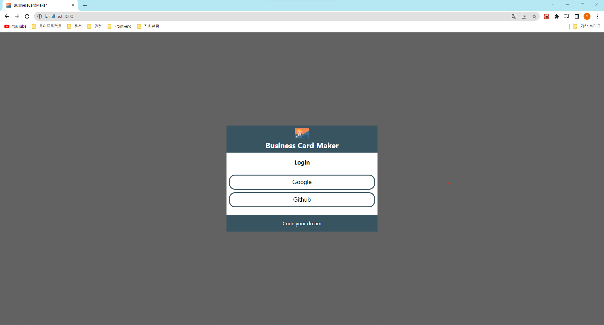

# Bussiness Card Maker

구글 및 깃헙 아이디로 로그인이 가능하다.
카드 추가를 하게 되면 Card Preview를 볼 수 있다.
카드 수정, 삭제 및 로그아웃이 가능하다.

  
개요

  <ol>
    <li><a href="#about-the-project">About The Project</a></li>
    <li><a href="#skills">Skills</a></li>
    <li><a href="#screen-shots">Screen Shots</a></li>
    <li><a href="#acknowledgements">Acknowledgements</a></li>
    <!-- <li><a href="#what-i-learned">What I Learned</a></li> -->
  </ol>

 

---

## About The Project

드림코딩 React Basic Business Card Maker 
JavaScript버전을 TypeScript로 진행 

## Skills

- React
- TypeScript
- HTML / PostCSS
- firebase
- cloudinary

## Screen Shots

- Login page  
  

- Home page  
  

## Functions

- Login
- Save Card
- Update Card
- Remove Card
- PreView
- Logout

## Acknowledgements

- [Firebase](https://firebase.google.com/)
- [cloudinary](https://cloudinary.com/)
